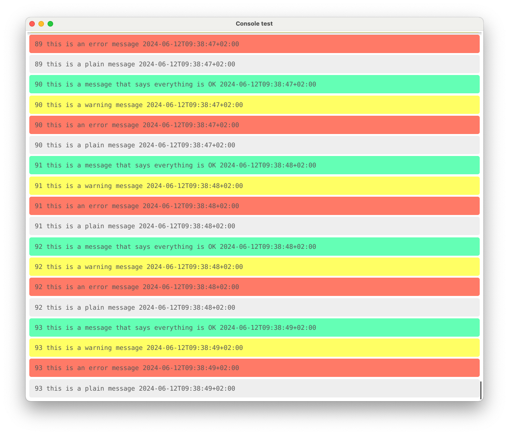

# Console Fyne Widget

`Console` is a simple fyne Widget intended for logging messages to a window.

[](https://pkg.go.dev/github.com/borud/console)



## Example

A very simple usage example:

```go
package main
import (
    "fmt"
    "time"

    "fyne.io/fyne/v2"
    "fyne.io/fyne/v2/app"
    "github.com/borud/console"
)

func main() {
    app := app.New()
    win := app.NewWindow("Console test")
    win.Resize(fyne.NewSize(1000, 1000))
    
    console := console.NewConsole()
    console.ScrollToBottom = true
    console.MaxLines = 1000

    go func() {
        for i := 0; ; i++ {
            console.Append(fmt.Sprintf("This is log message %d at %s", i, time.Now().Format(time.RFC3339)))
           time.Sleep(500 * time.Millisecond)
        }
    }()

    win.SetContent(console)
    win.ShowAndRun()
}
```

## Building example

There is a slightly more elaborate example included in `cmd/console` which you can build by running

```shell
make
```

This will produce the binary `bin/console`.

## Caveats

Note that I'm very new to Fyne so this widget does not seem to be very performant.  But if you can live with that (at least until I learn more about Fyne), by all means, use it.  If you have ideas on how to improve it, I'd love to hear from you and learn.  I made this mostly because I needed the functionality in an application.

You can find me on the [Gophers Slack](https://gophers.slack.com/archives/D026HLJ31H7)
